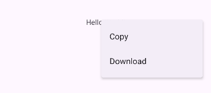
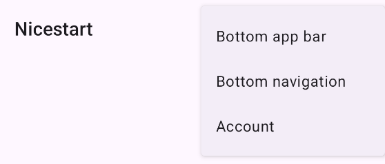
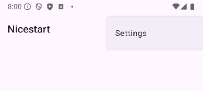
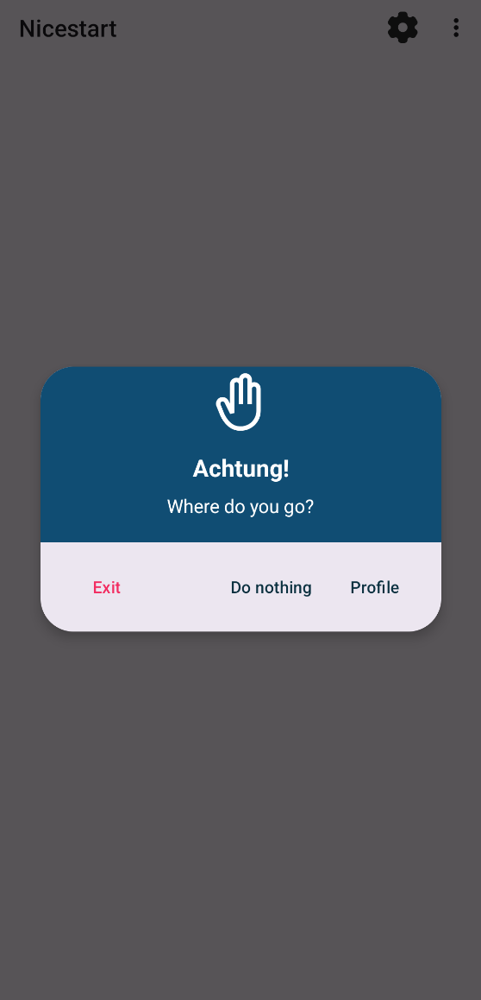
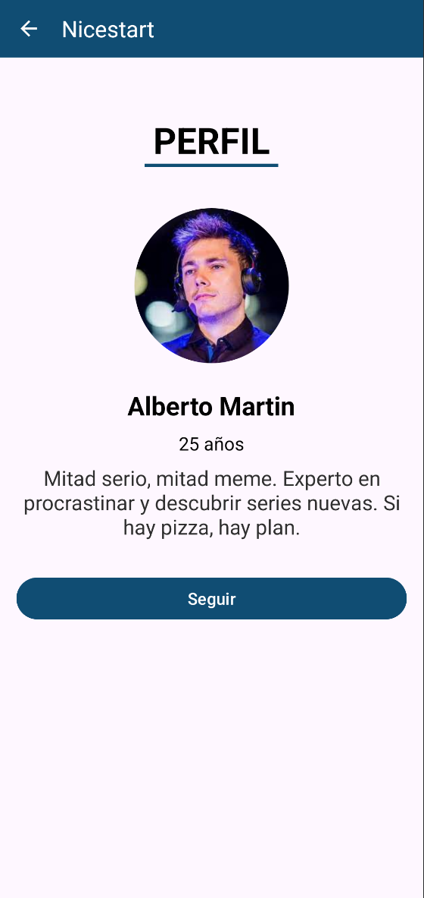
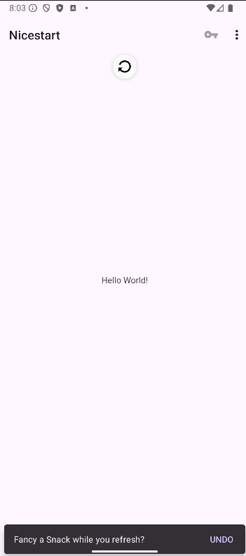

# **NiseStart**

**NiseStart** es una aplicación Android creada con el propósito de explorar y practicar el diseño de interfaces modernas, limpias y agradables.  
Se trata de un proyecto orientado al aprendizaje, que implementa principios actuales de **UI/UX** y buenas prácticas en Android.

  

---

## 🚀 **Características principales**
- Pantallas completas de **Splash**, **Login**, **Registro**, **Main**  y **Profile**
- Interfaz basada en **Material Design**  
- Navegación intuitiva con enfoque en la experiencia de usuario  
- Código limpio, organizado y comentado  
- Uso de menús contextuales, App Bar y Swipe Refresh  

---

## 🧰 **Tecnologías utilizadas**
- **Lenguaje:** Kotlin 

---

# 📱 **Funciones de la Aplicación**

## **1) Splash Activity**
Pantalla inicial que aparece durante 5 segundos.

Incluye:
- Animación 
- Fuente personalizada  
- Transición suave hacia Login  

  

---

## **2) Login Activity**
Pantalla para iniciar sesión.

Características:
- Botón para ir a Registro  
- Diseño minimalista y accesible  
- Validación básica de campos  

  

---

## **3) Signup Activity**
Pantalla para que nuevos usuarios se registren.

Incluye:
- Distribución clara y legible  
- Estética coherente con Login  
- Campos organizados y bien espaciados  

  

---

## **4) Main Activity**
Pantalla principal donde se agrupan utilidades, menús, elementos visuales y ejemplos de interacción.

---

## 📝 **Menú Contextual**
Aplicado sobre el `TextView` central. Ofrece:

- **Copy**  
- **Download**

  

---

## 📂 **Menú de la App Bar**
Incluye opciones rápidas y un submenú:

- **Settings**
- **Copy**
  - Bottom app bar  
  - Bottom navigation  
  - Account  

El menú se define en `menu.xml` usando `showAsAction` para indicar qué íconos se muestran en la barra.

  
  

### 🔔 **Alert Dialog (Account)**
Al seleccionar **Account**, se muestra un cuadro de diálogo con opciones como:
- Ir a **ProfileActivity**
- Salir de la aplicación

  

  

---

## 🔄 **Swipe Refresh**
El contenido puede actualizarse deslizando hacia abajo.

Proceso:
1. Se activa el `OnRefreshListener`  
2. Se detiene la animación con `setRefreshing(false)`  
3. Se muestra un **Snackbar** informativo  
4. El botón **UNDO** muestra un segundo Snackbar  

  

---

## 📄 Licencia
>This repository is licensed under  
>[Creativecommons Org Licenses By Sa 4](http://creativecommons.org/licenses/by-sa/4.0/)
