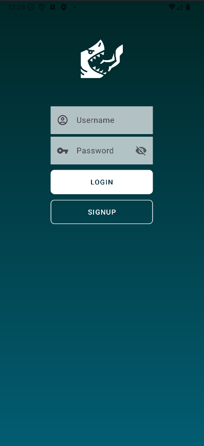
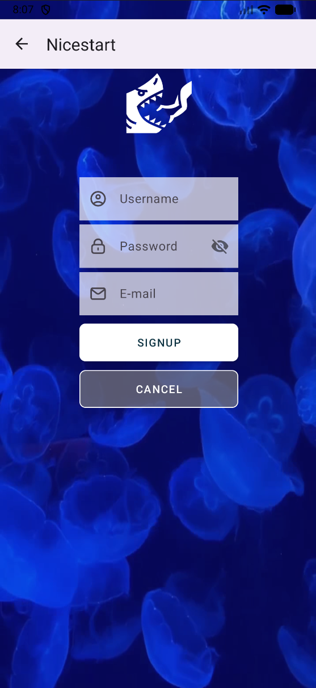

# NICESTART

**NiseStart** es una aplicación Android creada con el propósito de experimentar con interfaces modernas, limpias y agradables**.  
Está diseñada como un proyecto de práctica y demostración de diseño de UI/UX en Android, utilizando las mejores prácticas y componentes visuales.
 

  

## Características principales
- Pantallas de **Login** y **Registro** completamente funcionales.  
- Uso de **Material Design** para una experiencia fluida y atractiva.  
- Código limpio y fácil de entender para fines educativos.
 

## Tecnologías utilizadas

- **Lenguaje:** Kotlin
 

## Capturas de pantalla

**Login Activity**  

 

**Signup Activity**  

 

## License
>This repository is licensed under
>[Creativecommons Org Licenses By Sa 4](http://creativecommons.org/licenses/by-sa/4.0/)
