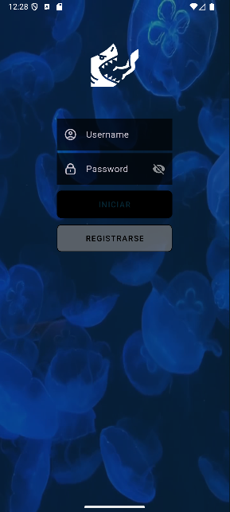
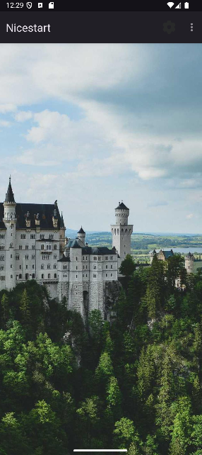
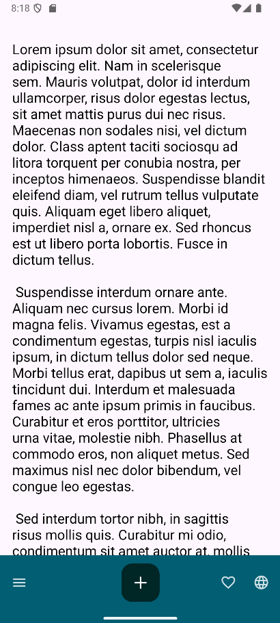
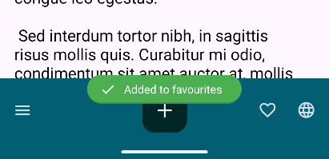
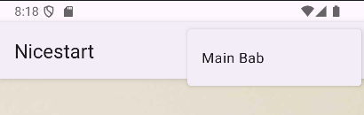

#  **NiseStart**

**NiseStart** es una aplicación Android creada con el propósito de explorar y practicar el diseño de interfaces modernas, limpias y agradables.  
Es un proyecto orientado al aprendizaje que implementa principios actuales de **UI/UX** y buenas prácticas en Android.

<p align="center">
  
</p>
<br>

## **Características principales**
- Pantallas completas de **Splash**, **Login**, **Registro**, **Main**, **Profile** y **MainBab**.
- Navegación intuitiva con enfoque en la experiencia de usuario.
- Código limpio, organizado y comentado. 
- Uso de menús contextuales, App Bar, Swipe Refresh, Toasts, entre otros.
<br>

## **Tecnologías utilizadas**
- **Lenguaje:** Kotlin  
<br>

# **Funciones de la Aplicación**


## **1) Splash Activity**
Pantalla inicial que aparece durante 5 segundos.

Incluye:
- Animación  
- Fuente personalizada  
- Transición suave hacia Login  


  

<br>

## 2) Login y Signup

| Login Activity | Signup Activity |
|----------------|----------------|
|  |  |
| **Pantalla para iniciar sesión** <br> - Botón para ir a Registro <br> - Diseño minimalista y accesible <br> - Validación básica de campos | **Pantalla para registro de nuevos usuarios**  <br>  - Distribución clara y legible  <br> - Estética coherente con Login <br> - Campos organizados y bien espaciados |
 
<br>

## **3) Main Activity**
Pantalla principal donde se agrupan utilidades, menús, elementos visuales y ejemplos de interacción.  
Cuenta con una función de *refresh* que al actualizar cambia la imagen.

**Proceso del Swipe Refresh:**
1. Se activa el `OnRefreshListener`  
2. Se detiene la animación con `setRefreshing(false)`  
3. Se muestra un **Snackbar** informativo  
4. El botón **UNDO** muestra un segundo Snackbar  

### 🖼️ **Vista de imágenes del Main**

| Imagen 1 | Imagen 2 | Imagen 3 |
|---------|----------|----------|
|  |  |  |


### 📌 **Menú Contextual**
Aplicado sobre el refresh central.  
Al mantener pulsado ofrece las opciones **Copy** y **Download**.

  


### 📌 **Menú de la App Bar**
Incluye opciones rápidas y un submenú:

- **Settings**
- **Copy**
  - Bottom app bar  
  - Bottom navigation  
  - Account  

  

## **4) Funciones Adicionales**

| Show Alert | Github Profile | Dialog Alert |
|------------|----------------|--------------|
| <p align="center"></p> | <p align="center"></p> | <p align="center"></p> |
| Muestra una alerta con animación desde arriba | Abre un activity que muestra mi perfil de GitHub | Muestra un Dialog con 3 opciones para el usuario:<br>- Salir de la aplicación<br>- No hacer nada<br>- Ir al Profile Activity |

<br>


Utilizo un **WebView** para mostrar directamente la página de mi perfil de GitHub dentro del activity, permitiendo una integración limpia y fluida sin necesidad de abrir un navegador externo.

```kotlin
WebView miVisorWeb;

miVisorWeb = findViewById(R.id.vistaweb);

miVisorWeb.getSettings().setJavaScriptEnabled(true);
miVisorWeb.loadUrl("https://github.com/AL3X-AFK");
```


### ㊗️ Idiomas
Inlcuyo en Values las opciones para lenguajes en Ingles y Español.
Ahora dependiento el idioma configurado en el dispositivo, se utilizara un valor u otro.
<p></p>


<br>

### 🌒 Modo oscuro
Creando en Values/Colors un nuevo archivo colors.xml estan los colores personalizados para el modo oscuro.
| Modo Oscuro | Modo Claro |
|------------|----------------|
| <p align="center"></p> | <p align="center"></p> |
| <p align="center"></p> | <p align="center"></p> |

<br>

### 📱 Main Bab
`MainBab` implementa una **Bottom App Bar** con comportamiento dinámico que mejora la experiencia de navegación del usuario.
<br>
**Scroll hacia abajo:** la barra se oculta automáticamente
<br>
**Scroll hacia arriba:** la barra vuelve a mostrarse
<br>


La Bottom App Bar incluye un **menú desplegable** con distintas acciones disponibles.
<br>


Al seleccionar cualquiera de las opciones del menú, se muestra un `Toast` informativo indicando la acción seleccionada.
<br>


Para acceder a esta `Activity` se hara desde el main, aparecera entre las opciones del menú superior.
<br>


<br>


### 🌐 **Pull request enviado**

He realizado algunos ajustes en la interfaz de usuario para mejorar la legibilidad y la estética de las pantallas de **Login** y **Signup**:

- El color del **hintText** de los `EditText` en ambas actividades no resultaba visualmente agradable, por lo que se ajustó su tonalidad.
- Se modificaron las **letras de los botones** de Login (en `LoginActivity`) y Signup (en `SignupActivity`) para mejorar su visibilidad.
- Los botones **Signup** (en `LoginActivity`) y **Cancel** (en `SignupActivity`) no contaban con un fondo, dificultando su lectura.  
  Ahora cuentan con un **background con transparencia**, lo que mejora el contraste y la visibilidad.
- Todos los colores utilizados provienen de la paleta definida en **`colors.xml`**, garantizando consistencia con la identidad visual de la aplicación.

#### 📌 Fragmentos de código utilizados

```
style="@style/buttoninline"
android:textColor="@color/purple_700"

app:startIconDrawable="@drawable/keyicon"
app:hintTextColor="@color/purple_700"
```
<br>


### 🌐 **Pull request recibido**
He recibido un pull request donde se recomienda extraer textos escritos directamente en los archivos XML y almacenarlos en strings.xml, siguiendo buenas prácticas de mantenibilidad y localización.

#### 📌 Strings sugeridos en el pull request recibido
```
<string name="perfil">Perfil</string>
<string name="contentdescription">contentdescription</string>
<string name="dialog_message">Where do you go?</string>
<string name="achtung">Achtung!</string>
```
<br>

## 📄 **Licencia**

> This repository is licensed under  
> [Creativecommons Org Licenses By Sa 4](http://creativecommons.org/licenses/by-sa/4.0/)
